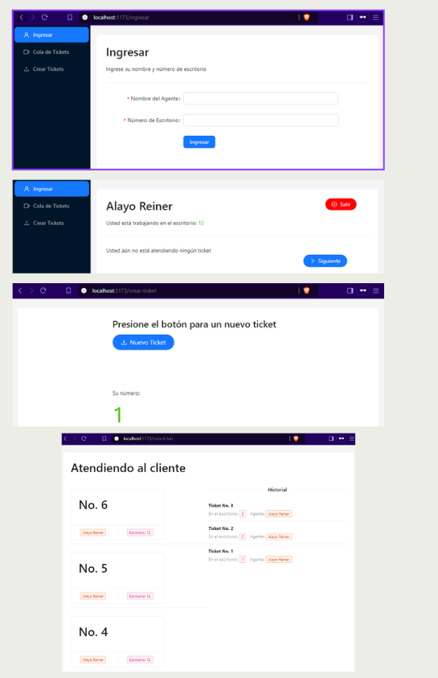

## Aplicación de Gestión de Tickets

## Tecnologías Utilizadas:

- **Frontend:** React con Ant Design, gestionando rutas con React Router y comunicación en tiempo real con Socket.IO.
- **Backend:** Node.js con Express, utilizando Socket.IO para la comunicación en tiempo real y Nodemon para un desarrollo más eficiente.

## Funcionalidades Principales:

- **Login:** Acceso seguro para los trabajadores.
- **Interfaz de Usuario:** Muestra el nombre del trabajador, número de escritorio y el ticket actual en atención.
- **Creación de Tickets:** Permite a los usuarios generar nuevos tickets.
- **Historial de Tickets:** Sección que lista todos los tickets atendidos, mostrando el número del ticket, el nombre del trabajador y el escritorio asignado.

## Modelos Implementados:

- **Server:** Configuración del servidor y manejo de rutas.
- **Sockets:** Comunicación en tiempo real entre el cliente y el servidor.
- **Ticket-List:** Gestión de la lista de tickets.
- **Ticket:** Modelo de datos para los tickets individuales.
